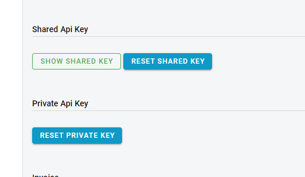

Authentication
-----------------------------------------------------------------

### Authentication/Authorization type

* Bearer (oauth2)
    - Parameter Name: **Authorization**, in: header. Standard Authorization header using the Bearer scheme. Example: `bearer {access_token}`

### Get Access Token

`POST {{IdentityServerAddress}}/connect/token`

> Live Identity Server Address is [https://identity.e-c.co.il](https://identity.e-c.co.il)

> Headers

|Name|Value|
|---|---|
|Content-Type|application/x-www-form-urlencoded|
|Content-Length| calculated when request is sent|
|Host|calculated when request is sent|


> Body parameter (`x-www-form-urlencoded`)

```php
<?php
//Access token
function getToken(){
	$ch = curl_init();
	curl_setopt($ch, CURLOPT_URL,"https://identity.e-c.co.il/connect/token");
	curl_setopt($ch, CURLOPT_POST, 1);
	
	//Remove for production code. ONLY FOR TEST PURPOSES
	curl_setopt($ch, CURLOPT_SSL_VERIFYPEER, false);

	$data = array('client_id'=>'terminal',
				  'grant_type'=>'terminal_rest_api',
				  'authorizationKey'=>'YOUR_TERMINAL_PRIVATE_KEY');
				  
	curl_setopt($ch, CURLOPT_POSTFIELDS, http_build_query($data));
	curl_setopt($ch, CURLOPT_HTTPHEADER, array('Content-Type: application/x-www-form-urlencoded'));

	// receive server response ...
	curl_setopt($ch, CURLOPT_RETURNTRANSFER, true);
	$server_output = curl_exec ($ch);
	curl_close ($ch);

	if($server_output){
		$response = json_decode($server_output);
		return $response->access_token;
	}
	//something went wrong
	return false;
}
?>
```

|Name|Value|
|---|---|
|client_id|terminal|
|grant_type|terminal_rest_api|
|authorizationKey|{{TerminalApiKey}}|


You can get `TerminalApiKey` by using `Reset Private Key` button on merchant's portal:



> Please note - you need to store given key securely. You cannot get active value from the merchant's portal - you only can reset current value (new key will be generated and old key will be no longer valid)

> Response

```json

{
    "access_token": "eyJhbGciOiJSUzI1NsImtpZCI6Ij.....q7MQ8jfwbQ_JKJif_7lTuiVhOGWA",
    "expires_in": 86400,
    "token_type": "Bearer",
    "scope": "transactions_api"
}

```

|Name|Type|Description|
|---|---|---|
|access_token|string|Value which should be added to each API request in Authorization header with Bearer prefix `Bearer {{access_token}}`|
|expires_in|number|number of seconds before token will be expires|
|access_token|string|always Bearer|
|scope|string|API scope|


<br/><br/>
