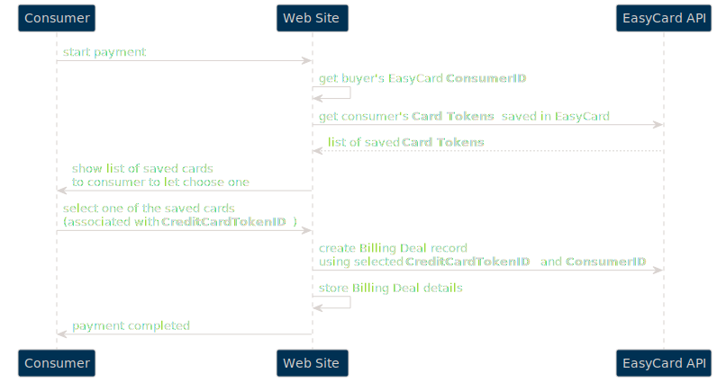

EasyCard Next Generation API v1 - _Billing Deals (Recurring Payments)_
=================================================================

<pre>Create recurring payments</pre>

Sections
-------------------------------
- [Environments](Readme.md#environments)

- [Examples](Readme.md#examples)

- [Full API description](Readme.md#full-api-description-swagger)

- [Authentication](Readme.md#authentication)

- [Billing Deals (Recurring Payments) - general behavior](#billing-deals-recurring-payments---general-behavior)

- [How to use `Consumer` and saved `Card Token`](#how-to-use-consumer-and-saved-card-token)

- [Removing `Consumer's` saved `Card Tokens`](#removing-consumers-saved-card-tokens)

  

Environments
-----------------------------------------------------------------

Please see [Base API information](Readme.md#environments)

  

Full API description (swagger)
-----------------------------------------------------------------

Please see [Full API description](Readme.md#full-api-description-swagger)

  

Authentication
-----------------------------------------------------------------

Please see [Authentication](Readme.md#authentication)

  

Examples
-----------------------------------------------------------------

Please see [Examples](Readme.md#examples)

  

- - -

Billing Deals (Recurring Payments) - general behavior
-------------------------------
> In general whole process is very similar to [Checkout Page - Only Save Consumer's Card](CheckoutPage.md#checkout-page---only-save-card) but at the end you need to send API call to create `Billing Deal` itself.

You can create Recurring Payments (`Billing Deals`) using [Transactions API](TransactionsApi.md#create-billing-deal), but - the main point is that to have ability to withdraw money from consumer's credit card, this _card should be saved in EasyCard system first_.  _`Checkout Page` should be used to collect card data_ (card details will be filled by buyer). When creating [`Payment Intent`](TransactionsApi.md#create-payment-link-to-checkout-page) using API, please specify `UserAmount = false` and `paymentRequestAmount = 0`. Please note that in this case _EasyCard `TransactionID` will not be added to redirect url but `TokenID` will be added_. This `TokenID` is an ID of saved consumer's card inside EasyCard system.

Next point is that saved credit cards (and `Billing Deal` itself) is always attached to the `Consumer` record, so to be able to create `Billing Deal` you need to [create `Consumer` record](MetadataApi.md#create-consumer-record) first (or use [previously created one](MetadataApi.md#get-consumers-list)). 

> Please note, that you can ask customer to save his card and then create `Billing Deal` at any point of time _later_ as you need - so card saving is not required step of Billing Deal process if the card already saved. Several cards tokens can be added to the same `Consumer` record (you can [get the list of saved cards](TransactionsApi.md#get-tokens-by-filters) which can be used in deal by API).

 

How to use `Consumer` and saved `Card Token`
-------------------------------

As it is described above, `Consumer` record is required if you want to create Billing Deals (Recurring Payments). It is strongly recommended to do not create new `Consumer` record per each deal - you can use API to find existing consumer by original ID from your system (please use `ExternalReference` to store it), consumer's email, NationalID etc. But preferred way is to save EasyCard's `ConsumerID` to your system.

So, there are next possible situations:

* Consumer record is not exist in EasyCard system yet - so you can create it and then use `ConsumerID` from EasyCard (this case is described in previous section)

* If Consumer already added to EasyCard system, you can use [one of the saved `Card Tokens`](TransactionsApi.md#get-tokens-by-filters) (you do not need to use `Checkout Page` in this case)

 

* The last case when you need to add new `Card Token` to previously created `Consumer` record. It can happens in next cases - no cards was saved previously, consumer do not want to use one of the previously saved cards but want to add new one, all previously saved cards are expired or removed by administrator ot customer.

 

Removing `Consumer's` saved `Card Tokens`
-------------------------------

Once Card Token was added at some point, consumer (or administrator) should have ability to remove saved card from the system. Please use [Remove Saved Card Token method](TransactionsApi.md#delete-credit-card-token) to remove saved card by ID.

