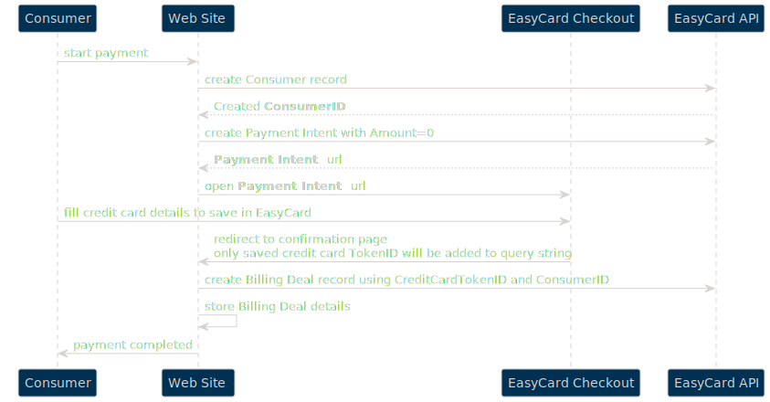

EasyCard Next Generation API v1 - _Billing Deals (Recurring Payments)_
=================================================================

<pre>Create recurring payments</pre>

Sections
-------------------------------
- [Environments](Readme.md#environments)

- [Examples](Readme.md#examples)

- [Full API description](Readme.md#full-api-description-swagger)

- [Authentication](Readme.md#authentication)


<br/><br/>

Environments
-----------------------------------------------------------------

Please see [Base API information](Readme.md#environments)

<br/><br/>

Full API description (swagger)
-----------------------------------------------------------------

Please see [Full API description](Readme.md#full-api-description-swagger)

<br/><br/>

Authentication
-----------------------------------------------------------------

Please see [Authentication](Readme.md#authentication)

<br/><br/>

Examples
-----------------------------------------------------------------

Please see [Examples](Readme.md#examples)

<br/><br/>

- - -

Billing Deals (Recurring Payments) - general behavior
-------------------------------

You can create Recurring Payments (`Billing Deals`) using [Transactions API](TransactionsApi.md), but - the main point is that to have ability to withdraw money from consumer's credit card, this card should be saved in EasyCard system - _`Checkout Page` should be used to collect this data_ (will be filled by buyer). So - it is not enough just to use API!

Next point is that saved credit cards always attached to `Consumer` record, so to be able to create `Billing Deal` you need to create `Consumer` record first. 

```
In general whole process is very similar to [regular checkout using Consumer](CheckoutPage.md#checkout-page---create-consumer-flow) but at the end you need to send API call to create `Billing Deal` itself.
```

Please note, that you can just ask customer to save his card and then create `Billing Deal` at any point of time as you need. Several cards tokens can be added.

 


How to use `Consumer` and saved `Card Token`
-------------------------------

As it is described above, `Consumer` record is required if you want to create Billing Deals (Recurring Payments). It is strongly recommended to do not create new `Consumer` record per each deal - you can use API to find existing consumer by original ID from your system (please use `ExternalReference` to store it), consumer's email, NationalID etc. But preferred way is to save EasyCard's `ConsumerID` to your system.

So, there are next possible situations:

* Consumer record is not exist in EasyCard system yet - so you can create it and then use `ConsumerID` from EasyCard

* If Consumer already added to EasyCard system, you can use one of the saved `Card Tokens` or

* add new `Card Token`
