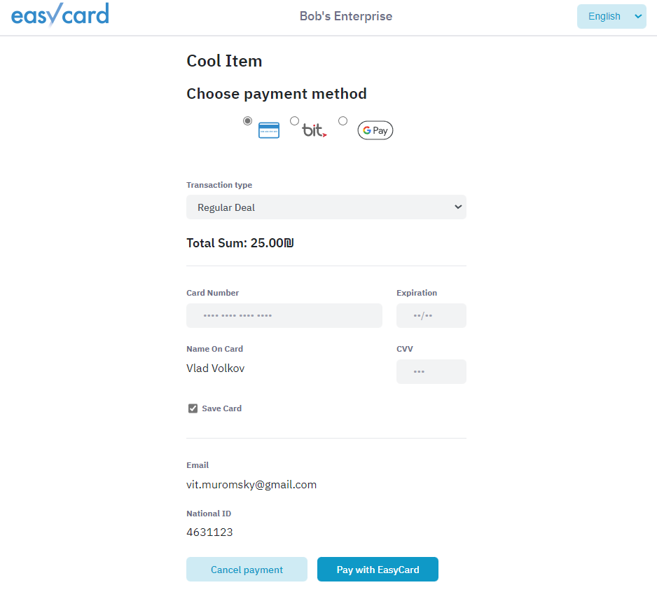
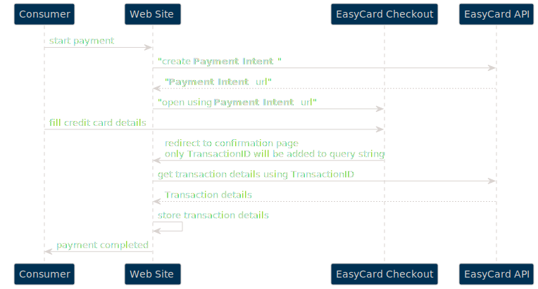
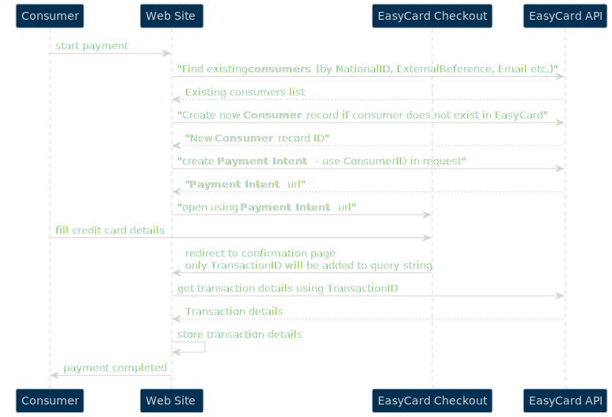

EasyCard Next Generation API v1 - _Checkout Page (Redirect Page)_
=================================================================

<pre> The simple way to collect payments hosted by EasyCard. </pre>

Sections
-------------------------------
- [Environments](Readme.md#environments)

- [Examples](Readme.md#examples)

- [API reference (used within Checkout Page)](TransactionsApi.md)

- [Checkout Page - common information](#checkout-page---common-information)

- [Configuration in EasyCard Merchant's Portal](#configuration-in-easycard-merchants-portal)

- [Classic Checkout Page](ClassicCheckoutPage.md) 

- [Advanced Checkout Page](#advanced-checkout-page)

- [Checkout Page - Create Consumer flow](#checkout-page---create-consumer-flow)

- [Metadata API](MetadataApi.md)

 

The purchase process on an e-commerce site includes three steps: searching for products to buy, filling in delivery details and making a purchase on a payment page. 
The most sensitive in the process is the payment page.

One option is to enter the payment information on the site itself, but then the entire site, software and servers, must meet the PCI standard and go through a long and expensive certificate process. 
The more recommended option is to use the Redirect interface, the user is redirected to a payment page located on a remote server and is part of the website of a company certified by the PCI standard. This ensures that the payment page has passed testing and certification as part of that company’s certification. 
This saves a lot of time in developing the clearing interface,
Makes it easier for the site to get approval from the credit card companies and most importantly gives peace of mind that the credit data is secure and not stored at all on the trading site.  

EasyCard’s Redirect debit page is included in the company’s PCI certification, PCI DSS Level 1 and is secured according to the strongest standards of credit card companies and ensures secure execution of credit charges. 

  

Environments
-------------------------------

Please see [Base API information](Readme.md#environments)

  

API reference (used within Checkout Page)
-------------------------------

Please see [Transactions API](TransactionsApi.md)

  

Examples
-----------------------------------------------------------------

Please see [Examples](Readme.md#examples)

  

Checkout Page - common information
-------------------------------

There are two options to generate Checkout Page:
 - classic style with query string which contains all deal parameters (which can be used first of all to support legacy systems)
 - Payment-Intent based Checkout Page

 

> Please note that under the hood Checkout Page generates regular payment transaction, so all documentation and settings related to transactions are relevant also for transactions generated by Checkout Page - please see corresponding documentation.

> Checkout Page url for live environment is [https://checkout.e-c.co.il](https://checkout.e-c.co.il)

<!-- 

 -->

  

> Checkout page can be opened inside iframe

- - -

Configuration in EasyCard Merchant's Portal
-------------------------------------------

On EasyCard Merchant's portal [https://merchant.e-c.co.il](https://merchant.e-c.co.il) there are few settings related to Checkout Page. To open the settings page you need to press on your user name link:

 

- - -

### Redirect urls

Then you need to find **Checkout Redirect URLs** section:

Please add base address of your website here. You can use several base addresses. ``RedirectUrl`` in query string described above should belongs to one of the configured base urls.

 

- - -

### Custom logo and stylesheet

You can specify custom logo image and custom css file. Please use **Checkout** section and **Payment Request** section:

 

Classic Checkout Page
-------------------------------------------

Please refer to: [Classic Checkout Page](ClassicCheckoutPage.md) 

  

Advanced Checkout Page
-------------------------------------------

EasyCard Next Generation also provides more secured and solid way to collect Checkout transactions using Payment Intent API:

 

The general idea is to keep all information required for Checkout Page securely in structured way (which is more convenient than query string). You can use `Create Payment Intent API method` to create it. This method returns short url which you can use to redirect your consumer to Checkout Page (so, in other words this method creates payment link).

As soon consumer will enter credit card details and pressed `Pay With EasyCard` button, Checkout Page will be redirected to the link, specified in `Create Payment Intent` parameters. EasyCard `TransactionID` will be added to redirect url.

Then you can use this `TransactionID` to get payment transaction details from the API - please use `Get Transaction Details` method.

Please find out API description in section below.

> Please note, all request should be secured with Authorization header `Bearer {{access_token}}` - see **Authentication** section below to get information about how to obtain this token.

> You can simple check how this functionality works by using **Payment Link** feature on Merchant's Portal:

  

Checkout Page - Create Consumer flow
-------------------------------------------

There is additional option to enhance integration of EasyCard and merchant's system. EasyCard provides ability for merchant to store miscelaneous metadata related to deals - first of all `Consumers` reference. You can create Consumer record via [Metadata API](MetadataApi.md) and then use ConsumerID when creating `PaymentIntent`.

 