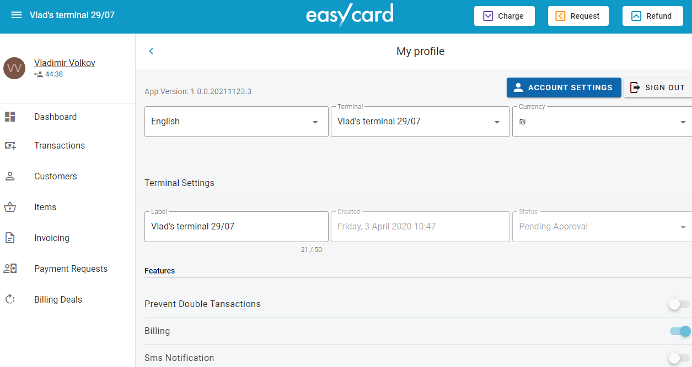

# Classic Checkout Page

The general behavior is next:

 

> Checkout page can be opened inside iframe

<br/><br/>

- - -

## Query string parameters

|Name|In|Type|Required|Description|
|---|---|---|---|---|
|Description|query|string|true|deal description|
|Name|query|string|true|consumer name|
|NationalID|query|string|false|consumer national id|
|Email|query|string|false|consumer's email|
|Phone|query|string|false|consumer's phone|
|Currency|query|string|false|currency in ISO format, like ILS, USD etc.|
|Amount|query|decimal|false|deal amount, can be omitted - see description below|
|UserAmount|query|boolean|false|use this flag if consumer can change payment amount|
|RedirectUrl|query|string|false|url on your website which will accept response from EasyCard|
|ApiKey|query|string|true|Shared api key - see description below|
|IssueInvoice|query|boolean|false|invoice will be generated by EasyCard if "true"|
|AllowPinPad|query|boolean|false|Pinpad device payment can be used within Checkout page|

> Sample query string:
```
https://checkout.e-c.co.il/?Description=Goods%20and%20services%20from%20Test%20Web%20Store%3A%20My%20Product&Name=John%20Smith&Email=testemail@gmail.com&Currency=ILS&Amount=99.99&RedirectUrl=https%3A%2F%2Fecng-testwebstore.azurewebsites.net%3A443%2FPaymentResult%3FInternalOrderID%3D123456&ApiKey=XXXXXXXX&IssueInvoice=True&AllowPinPad=False&UserAmount=False
```

> You can use simple **Test Web Store** (demo web page) which demonstrate query string redirect: [https://ecng-testwebstore.azurewebsites.net/](https://ecng-testwebstore.azurewebsites.net/)
> If you need to specify any additional parameters, like ``OrderID`` or some security key in your system, you can simple add it to ``RedirectUrl ``

<br/><br/>

- - -

## Configuration in EasyCard Merchant's Portal

On EasyCard Merchant's portal [https://merchant.e-c.co.il](https://merchant.e-c.co.il) there are few settings related to Checkout Page. To open the settings page you need to press on your user name link:


<br/>

- - -

### Redirect urls

Then you need to find **Checkout Redirect URLs** section:


Please add base address of your website here. You can use several base addresses. ``RedirectUrl`` in query string described above should belongs to one of the configured base urls.

<br/>

- - -

### Custom logo and stylesheet

You can specify custom logo image and custom css file. Please use **Checkout** section and **Payment Request** section:


<br/>

- - -
### Legacy redirect url response

In **Checkout Redirect URLs** section there is a flag **Extended response for checkout transaction** enables additional query string parameters which will be added to ``RedirectUrl`` by EasyCard. In this mode NextGen EasyCard will mimic EasyCard classic behavior.


> You can use **Test Web Store** to check all parameters which will be present in this mode.

In case if **Extended response for checkout transaction** is disabled, only EasyCard ``TransactionID`` will be present in response, then you can get transaction details via API (see below).

<br/>

- - -
## Shared API Key

You can get ``ApiKey`` for simple Checkout Page using **Show Shared Key** button in  **Checkout** section or generate ne key using **Reset Shared Key** button:


<br/><br/>