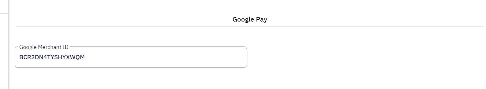
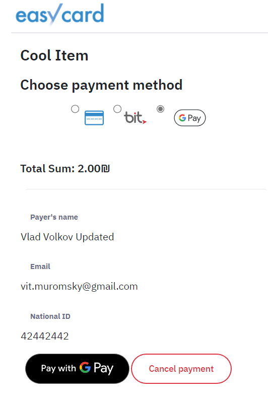

EasyCard Next Generation API v1 - _Using Google Pay&trade; on Checkout Page_
=================================================================

> If you are planning to provide [Google Pay&trade;](https://developers.google.com/pay) payment method to your consumers please check requirements below

[Google Pay&trade;](https://developers.google.com/pay) is the fast, simple way to pay with Google

Google Pay is compatible with the majority of modern Android devices across a wide variety of manufacturers and form factors, including mobile phones, tablets, and Wear OS by Google devices. 

https://developers.google.com/pay/issuers/overview/supported-devices

 

EasyCard configuration
-----------------------------------------------------------------

To allow _Google Pay_ payment method on EasyCard checkout page you need to enable _Google Pay Feature_

>Please note: for the moment you need to request EasyCard administration team to enable Google Pay feature for you.

Next, you need to specify your company _Google Merchant ID_ in terminal settings:

As a result, a new payment method will appear on the checkout page - Google Pay:

 

Google Pay&trade; and Wallet Console configuration
-----------------------------------------------------------------

Before enabling Google Pay feature in your EasyCard terminal, please ensure that your Google Pay account meets all requirements. Please use [Google Pay and Wallet Console](https://pay.google.com/business/console) for registration and management actions. 
For _Google Pay API integration type_ parameter please use "Gateway" option.
After registration you can get _Google Merchant ID_ using that console and then you need to request Google administrators to enabled your account for production.

> Please ensure that your company adheres to the Google Pay APIs [Acceptable Use Policy](https://payments.developers.google.com/terms/aup) and accepts the terms defined in the [Google Pay API Terms of Service](https://payments.developers.google.com/terms/sellertos).

 

Google Pay&trade; technical detail
-----------------------------------------------------------------

If you need more details about Google Pay API parameters what we are using on Checkout Page, please refer to the next documents: [IsReadyToPayRequest](https://developers.google.com/pay/api/web/reference/request-objects#IsReadyToPayRequest) and [PaymentDataRequest](https://developers.google.com/pay/api/web/reference/request-objects#PaymentDataRequest)

We support both _PAN_ONLY_ and _CRYPTOGRAM_3DS_ payment methods. Please note that PAN_ONLY available only for terminals which support "phone transactions" ("card not present"). Both payment options will be enabled automatically depends on terminal settings - you do not need to specify any parameters or make any additional settings.

You do not need to specify _gateway_ or _gatewayMerchantID_ - this is processed automatically.
 
We support only Israel based merchants. We support any authorization methods provided by _Shva_ (which is the same as for regular cards processing)

We support all card networks which works in Israel: "AMEX", "MASTERCARD", "VISA". If you need additional details - please contact our support.

We do not support billing addresses processing for now.

We do not expect that merchant will send any Google Pay related data via API - we are doing payments on  behalf of the merchant using our web checkout page.

 

Environments
-----------------------------------------------------------------
 
 Please note, that [Sandbox](Readme.md#environments) environment of EasyCard always configured for Google Pay _TEST_ environment and EasyCard Production is pointed to Google Pay _PRODUCTION_ environment.
 
 

NOTE
-----------------------------------------------------------------

Google Pay Payment method is allowed in Google Chrome Desktop only for Easy Card terminal where CVV and National ID are not required 
