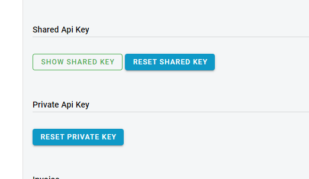

EasyCard Next Generation API v1
===============================

In this repository you can find out developer documentation and examples for EasyCard Next Generation payment system usage.

Sections
-------------------------------

- [Environments](#environments)

- [Examples](#examples)

- [Full API description (swagger)](#full-api-description-swagger)

- [Authentication](#authentication)

- [Checkout Page](CheckoutPage.md)

- [Transactions API](TransactionsApi.md)

- [Metadata API](MetadataApi.md)

- [Webhooks](Webhooks.md)

- [Ecwid payment method setup](ecng-ecwid/readme.md)

- [Billing (Recurring Payments)](Billing.md)
  
- [Google Pay&trade;](GooglePay.md)

<br/><br/>

Environments
-------------------------------


|Environment|API|Address|
|---|---|---|
|Sandbox|Transactions API|https://ecng-transactions.azurewebsites.net|
||Metadata API|https://ecng-profile.azurewebsites.net|
||Identity Server|https://ecng-identity.azurewebsites.net|
||Checkout Page|https://ecng-checkout.azurewebsites.net|
||||
|Live|Transactions API|https://api.e-c.co.il|
||Metadata API|https://merchant.e-c.co.il|
||Identity Server|https://identity.e-c.co.il|
||Checkout Page|https://checkout.e-c.co.il|

<br/><br/>

Examples
-------------------------------

- [Postman examples](/postman)
- [PHP examples](examples/php/EasyCard-Checkout-PaymentIntent-v1.php)
- [Asp.Net C# examples](examples/C#/TestWebStore.sln)


<br/><br/>

Full API description (swagger)
-----------------------------------------------------------------
> Please refer to Full API description if you need most recent development version

Development version: [https://ecng-transactions.azurewebsites.net/api-docs/index.html](https://ecng-transactions.azurewebsites.net/api-docs/index.html)

Live version: [https://api.e-c.co.il/api-docs/index.html](https://api.e-c.co.il/api-docs/index.html)


- - - - - - - - - - - - - - - - - - - - - - - - - - - - - - - - - 

Metadata API development version [https://ecng-profile.azurewebsites.net/api-docs/index.html](https://ecng-profile.azurewebsites.net/api-docs/index.html)

Live version [https://merchant.e-c.co.il/api-docs/index.html](https://merchant.e-c.co.il/api-docs/index.html)

<br/><br/>

- - - - - - - - - - - - - - - - - - - - - - - - - - - - - - - - -

Authentication
-----------------------------------------------------------------

### Authentication/Authorization type

* Bearer (oauth2)
    - Parameter Name: **Authorization**, in: header. Standard Authorization header using the Bearer scheme. Example: `bearer {access_token}`

### Get Access Token

`POST {{IdentityServerAddress}}/connect/token`

> Live Identity Server Address is [https://identity.e-c.co.il](https://identity.e-c.co.il)

> Headers

|Name|Value|
|---|---|
|Content-Type|application/x-www-form-urlencoded|

> Body parameter (`x-www-form-urlencoded`)

```php
<?php

$ch = curl_init();

curl_setopt($ch, CURLOPT_URL,"https://identity.e-c.co.il/connect/token");
curl_setopt($ch, CURLOPT_POST, 1);
curl_setopt($ch, CURLOPT_POSTFIELDS,
            "client_id=terminal&grant_type=terminal_rest_api&authorizationKey=hL5pXeI96df0wxCb....IWYcmhJH2bye1gg==");
curl_setopt($ch, CURLOPT_HTTPHEADER, array('Content-Type: application/x-www-form-urlencoded'));


// receive server response ...
curl_setopt($ch, CURLOPT_RETURNTRANSFER, true);

$server_output = curl_exec ($ch);

curl_close ($ch);

// further processing ....
if ($server_output == "OK") { ... } else { ... }

?>
```

|Name|Value|
|---|---|
|client_id|terminal|
|grant_type|terminal_rest_api|
|authorizationKey|{{TerminalApiKey}}|

You can get `TerminalApiKey` by using `Reset Private Key` button on merchant's portal:



> Please note - you need to store given key securely. You cannot get active value from the merchant's portal - you only can reset current value (new key will be generated and old key will be no longer valid)

> Response

```json

{
    "access_token": "eyJhbGciOiJSUzI1NsImtpZCI6Ij.....q7MQ8jfwbQ_JKJif_7lTuiVhOGWA",
    "expires_in": 86400,
    "token_type": "Bearer",
    "scope": "transactions_api"
}

```

|Name|Type|Description|
|---|---|---|
|access_token|string|Value which should be added to each API request in Authorization header with Bearer prefix `Bearer {{access_token}}`|
|expires_in|number|number of seconds before token will be expires|
|access_token|string|always Bearer|
|scope|string|API scope|


<br/><br/>