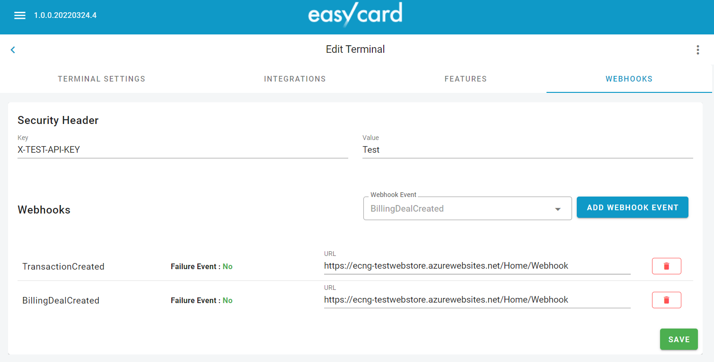
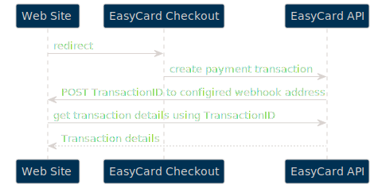

EasyCard Next Generation API v1 - _Webhooks_
=================================================================

EasyCard provides ability to use user-defined HTTP callbacks (Webhooks) triggered by several events in EasyCard system.

<br/>

Configuration
-----------------------------------------------------------------
 

First of all you need to specify security header (name and value) to protect merchant's site webhook endpoint. Only basic authentication supported for the moment. The same security header will be used for all requests.

Next, you need to select event type (for which you want to get webhook requests) and specify webhook url on your side.


```
You cannot use localhost* addresses, as well any intranet addresses
```

> Please note: for the moment you need to request EasyCard administration team to make Webhooks configuration for you.

<br/>

> Please note: for the moment Secure Header is not required. Delivery 2025

<br/>


Flow
-----------------------------------------------------------------

<!--  -->

This diagram shows example Webhook flow in case when `Payment Transaction` created using Checkout Page.

 

After Payment Transaction creation, appropriate event will be triggered and configured webhook will be executed. We will send POST request with very basic event information (see JSON description below), so as soon webhook received on merchant's site endpoint, you need to get appropriate entity from EasyCard API inside merchant's webhook handler code. For example, if it is Payment Transaction, JSON will have PaymentTransactionID as `entityReference`, then you need to call API to get transaction details (see EasyCard API description).


- - - - - - - - - - - - - - - - - - - - - - - - - - - - - - - - -

<br/>

Webhook format 
-----------------------------------------------------------------
JSON `POST` request will be sent to the configured url when the appropriate event is triggered:
```
{
    "eventID": "632eb049-8562-411d-ab9f-ab92007f0293",
    "terminalID": "fd483f66-7cf0-4e57-8661-ab9200804615",
    "correlationId": "80000029-0003-fe00-b63f-84710c7967bb",
    "eventName": "TransactionCreated",
    "entityType": "PaymentTransaction",
    "entityReference": "8e350a17-3aca-46e5-a885-ae62007c8b33",
    "entityExternalReference": "123456",
    "eventTimestamp": "2022-03-24T07:33:27.176308Z",
    "isFailureEvent": false,
    "errorMesage": "<error message will be present only in case of failure>"
}
```


-----------------------------------------------------------------
<br/>

Get transaction details using EntityReference from the Webhook event 
-----------------------------------------------------------------
Using EntityReference we can get transaction details

Need additional API Request  https://api.e-c.co.il/api/transactions/{{EntityReference}}

https://api.e-c.co.il/api/transactions/8e350a17-3aca-46e5-a885-ae62007c8b33 

<br/>

|Name|Type|Description|
|---|---|---|
|eventID|string(uuid)|Unique event reference|
|terminalID|string(uuid)|EasyCard terminal reference|
|correlationId|string(uuid)|Event reference in requests log|
|eventName|string|See events list below|
|entityType|string|See events list below|
|entityReference|string(uuid)|Internal entity reference in EasyCard system (for example PaymentTransactionID, ConsumerID etc.)|
|entityExternalReference|string|Entity reference in merchant's system|
|eventTimestamp|string(ISO date)|Event timestamp|
|isFailureEvent|boolean|Indicates if event is failure event (for example - "TransactionRejected")|
|errorMesage|string|Error message will be present only in case of failure|


<br/>

Events list
-----------------------------------------------------------------

Below you can find the list of all event available for webhook configuration for the moment:

|EntityType|EventName|IsFailureEvent|Description|
|---|---|---|---|
|PaymentTransaction|TransactionCreated|false|Payment transaction successfully created|
|PaymentTransaction|TransactionRejected|true|Payment transaction creation failed|
|||||
|BillingDeal|BillingDealCreated|false|Billing schedule created|
|BillingDeal|BillingDealUpdated|false|Billing schedule updated (including activate/deactivate)|
|||||
|CreditCardTokenDetails|CardTokenCreated|false|Consumer saved credit card|
|CreditCardTokenDetails|CardTokenDeleted|false|Saved credit card removed|
|CreditCardTokenDetails|CreditCardExpired|false|Saved credit card expired|
|||||
|Consumer|ConsumerCreated|false|Consumer record created|
|Consumer|ConsumerUpdated|false|Consumer record updated (including activate/deactivate)|
|||||
|Invoice|InvoiceGenerated|false|Invoice generated in invoicing system|
|Invoice|InvoiceGenerationFailed|true|Invoice generation failed|


