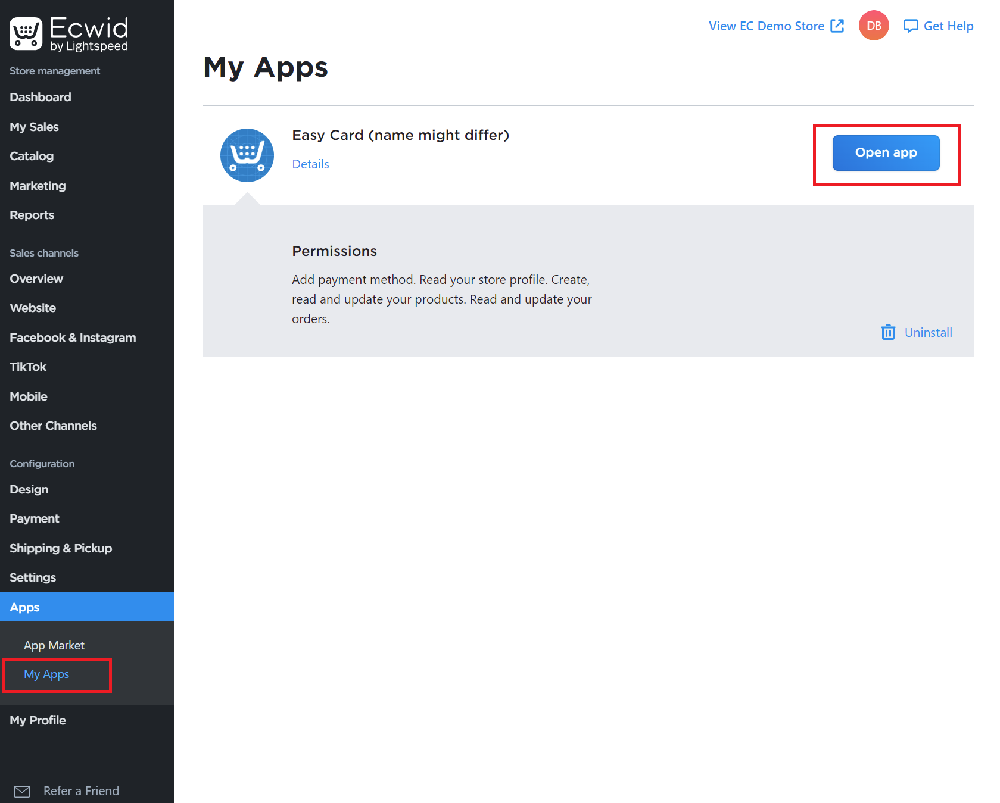

EasyCard Next Generation API v1 - _Ecwid Integration_
==============

> Short guide to integrate EasyCard into Ecwid as payment system

1. Open terminal settings and get 'Terminal Private Api Key'. Click on the 'Reset Private Key' button and copy the result

2. In the Ecwid control panel, navigate to 'My Apps' and then select EasyCard payment system and click 'Open App'

3. In the EasyCard setting page you can see just one input field. Paste previously copied 'Private Key' and click on 'Save' button.

4. Done. You can now close the page and use the Easy Card.